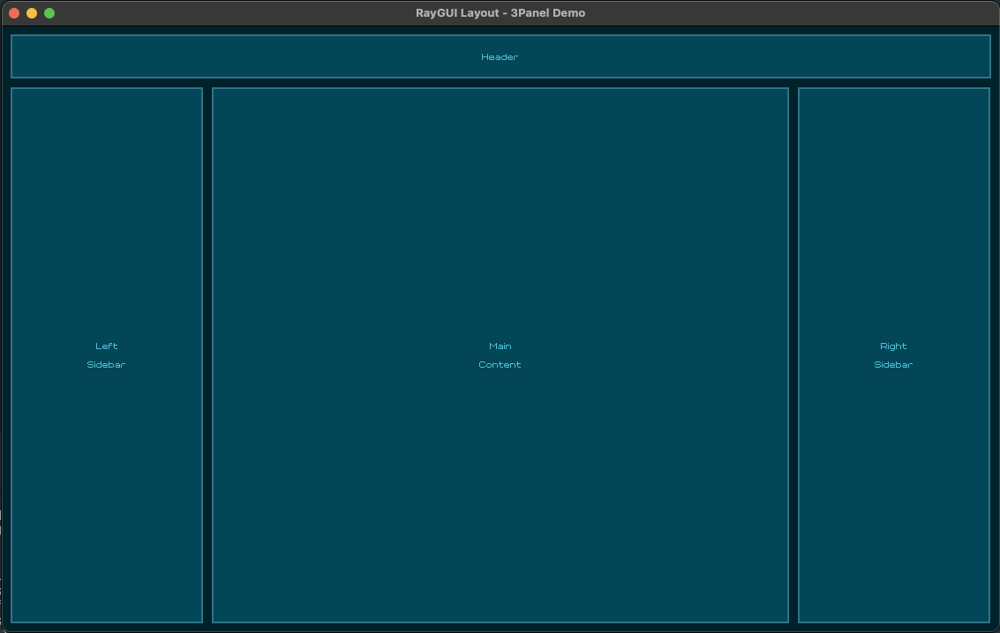
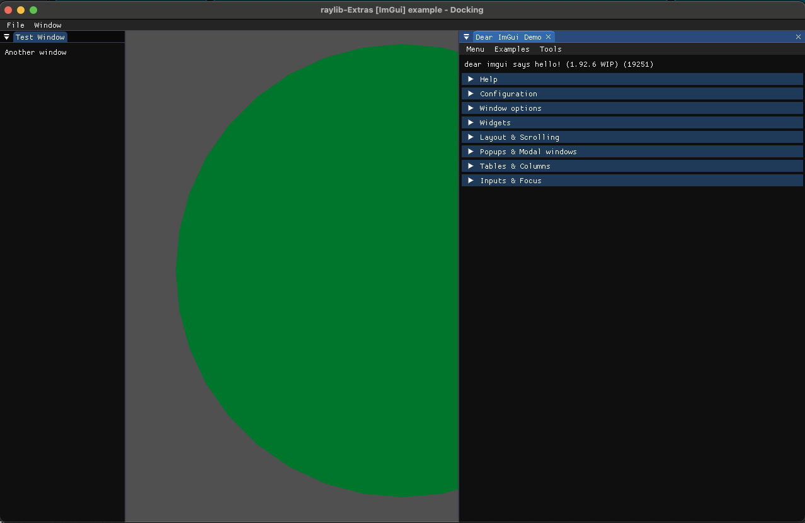

# Raylib CMake Starter for C++

This is a starter project for using [Raylib](https://www.raylib.com/) with C++ and CMake.
It comes packaged with Raylib, Raygui, RGLayout (mine), and imgui (with docker) integration with raylib (branch: imgui)

## Getting Started

1. Clone this repository
2. Initialize the submodules: `git submodule update --init --recursive`
3. Build `./b`
4. Run `./r`

## With Dear ImGui

1. Checkout the `imgui` branch
2. Initialize the submodules: `git submodule update --init --recursive`
3. Build `./b`
4. Run `./r`

## TODO

- [x] Add Dear ImGui integration with Raylib
- [x] Add rglayout 
- [ ] Support for ANGLE on MacOS (4x+ draw calls performance gains)
- [ ] Support for https://github.com/Bigfoot71/r3d for more advanced rendering with Raylib
- [ ] Support more Platforms
- [ ] Add optional ENet for Networking 